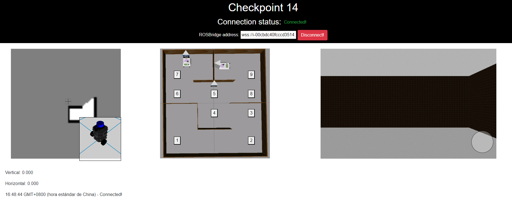

# CheckPoint 14 Web Development

<a name="readme-top"></a>

## About The Project
This project involves creating a comprehensive web application to control the TortoiseBot robot, a crucial step toward making robotics accessible to non-experts. The goal is to develop an intuitive, user-friendly interface that allows users to operate the robot seamlessly. The TortoiseBot will be used in a simulated environment, where it will perform tasks such as mapping the surroundings, navigating through obstacles, and reaching specific waypoints.
Key features of the web application include:

* Displaying a real-time map generated by the robot.
* Showing a 3D model of the TortoiseBot.
* Providing a live camera feed from the robot's perspective.
* Including a virtual joystick for manual control of the robot.
* Offering waypoint buttons to direct the robot to predefined locations.



<!-- GETTING STARTED -->
## Getting Started

### Software Prerequisites
* Ubuntu 22.04
* ROS Noetic


<p align="right">(<a href="#readme-top">back to top</a>)</p>

<!-- INSTALLATION -->
### Installation
1. Clone the repo:
   ```sh
   cd ~ && \
   git clone https://github.com/pvela2017/The-Construct-CheckPoint-14-Web-Development
   ```
2. Compile the simulation:
   ```sh
   source /opt/ros/noetic/setup.bash && \
   cd ~/The-Construct-CheckPoint-14-Web-Development/simulation_ws && \
   catkin_make
   ```
     
<p align="right">(<a href="#readme-top">back to top</a>)</p>


<!-- USAGE -->
## Usage
### Local Simulation
1. Launch the simulation:
   ```sh
   source /opt/ros/noetic/setup.bash && \
   source ~/The-Construct-CheckPoint-14-Web-Development/simulation_ws/devel/setup.bash && \
   roslaunch tortoisebot_gazebo tortoisebot_docking.launch
   ```
2. Launch ROSBridge and video server:
   ```sh
   source /opt/ros/noetic/setup.bash && \
   source ~/The-Construct-CheckPoint-14-Web-Development/simulation_ws/devel/setup.bash && \
   roslaunch course_web_dev_ros web.launch
   ```
3. Launch mapping:
   ```sh
   source /opt/ros/noetic/setup.bash && \
   source ~/The-Construct-CheckPoint-14-Web-Development/simulation_ws/devel/setup.bash && \
   roslaunch tortoisebot_slam mapping.launch
   ```
4. Run the waypoint action server:
   ```sh
   source /opt/ros/noetic/setup.bash && \
   source ~/The-Construct-CheckPoint-14-Web-Development/simulation_ws/devel/setup.bash && \
   rosrun course_web_dev_ros tortoisebot_action_server.py
   ```
5. Launch web server:
   ```sh
   cd ~/The-Construct-CheckPoint-14-Web-Development/webpage_ws/tortoisebot_webapp
   python -m http.server 7000
   ```   

<p align="right">(<a href="#readme-top">back to top</a>)</p>

<!-- RESULTS -->
## Results
[](https://www.youtube.com/watch?v=s4jkbh0bWyQ)

<!-- KEYS -->
## Key Topics Learnt
* ROSBridge & Video server.
* ROSJS.
* Frontend.
* Display Rviz and 3D models on the webapp.
